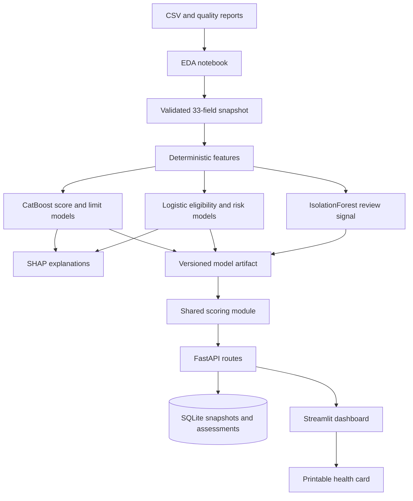
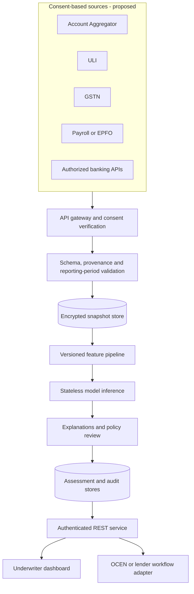

# Financial Health Card architecture and integration roadmap

This repository implements a local and hosted synthetic-data demonstration. The first diagram shows what exists in the code. The second describes a possible production design; those integrations and controls are not implemented or certified here.

## Implemented demonstration

The notebooks own data analysis, fixed train/validation/test splits, model comparison, held-out evaluation, and artifact creation. `scoring.py` owns validation, feature calculation, inference, explanations, recommendations, and printable cards. `api.py` owns REST routes and SQLite persistence. `dashboard.py` consumes those routes locally; the hosted entrypoint uses the same routes in process with temporary visitor storage.

Implemented controls include Pydantic field validation, forbidden outcome fields, finite/range checks, cross-field consistency, append-only snapshot and assessment rows, parameterized SQL, model version reporting, and explanation reconstruction checks. Supplied outcomes and the identifier are excluded from predictors.

The supplied data has one undated snapshot per business. The dashboard therefore shows current GST, UPI, banking, payroll, growth, and volatility measures. It does not invent historical transaction series.

## Technology stack

| Layer | Implemented technology | Purpose |
|---|---|---|
| Analysis | Jupyter, pandas, NumPy, matplotlib | Data quality, distributions, feature analysis |
| Modeling | scikit-learn, CatBoost | Baselines, selected predictors, anomaly review |
| Explainability | CatBoost SHAP and SHAP | Per-prediction contributions |
| Validation/API | Pydantic, FastAPI | Input contract and REST interface |
| Persistence | SQLite | Versioned demo snapshots and assessments |
| Dashboard | Streamlit, Plotly | Portfolio, card, evidence, and ingestion views |
| Packaging | joblib | Trusted local model artifact |

## Proposed production architecture

This is an integration strategy, not a live-integration claim. A production implementation would require authorized partnerships, current provider specifications, security review, and legal/compliance approval.

### Source adapters

- **Account Aggregator:** obtain an explicit purpose-bound consent artefact through an authorized AA/FIU setup; record consent reference, scope, reporting period, expiry, source, and retrieval status. Normalize authorized bank summaries and transactions into the snapshot contract.
- **ULI:** implement adapters only for data services available to the participating lender and business. Authenticate and validate requests according to the current RBIH interface and preserve source provenance.
- **OCEN:** map the health card and indicative recommendation into the applicable lender/LSP workflow. Lending policy, offer creation, agreements, mandates, and disbursement remain with authorized participants.
- **GSTN:** use authorized access to retrieve the permitted return and invoice aggregates. Align reporting periods before comparing GST, bank, and UPI measures.
- **Banking and payroll:** use authorized APIs or Account Aggregator data. Never assume GST, UPI, and bank inflows are independent revenue streams.
- **Other consent-based sources:** add a source-specific adapter, schema version, freshness rule, and provenance record before including a source in assessment.

### Production controls still required

- Authentication, authorization, tenant isolation, encryption, secrets management, rate limits, and network controls.
- Consent verification, revocation, purpose limitation, retention, deletion, and audit processes approved for the actual deployment.
- Idempotency keys, request hashes, queues/dead-letter handling, retry policy, and operational reconciliation.
- PostgreSQL or another managed durable database; immutable model registry and explicit promotion process.
- Monitoring for schema failures, freshness, missingness, latency, drift, calibration, subgroup performance, and observed lending outcomes.
- Validation on real outcomes, lending-policy review, fairness assessment, human escalation, and adverse-action requirements where applicable.

Potential scale components such as Redis, Kafka/Celery, webhooks, read replicas, or dedicated explanation workers should be introduced only when measured load and reliability requirements justify them. No performance claim is made for components that are not implemented.

## Boundaries

The demonstration does not claim live AA, ULI, OCEN, GSTN, bank, payroll, or utility connectivity. It does not verify consent artefacts, make loan approvals, estimate real probability of default, or establish production fairness. Synthetic held-out accuracy demonstrates the implementation workflow only.

Authoritative references for future integration: [Sahamati AA FAQ](https://sahamati.org.in/faq/), [RBIH ULI services](https://docs.rbihub.in/unified-lending-interface/services), and [OCEN](https://ocen.dev/).
