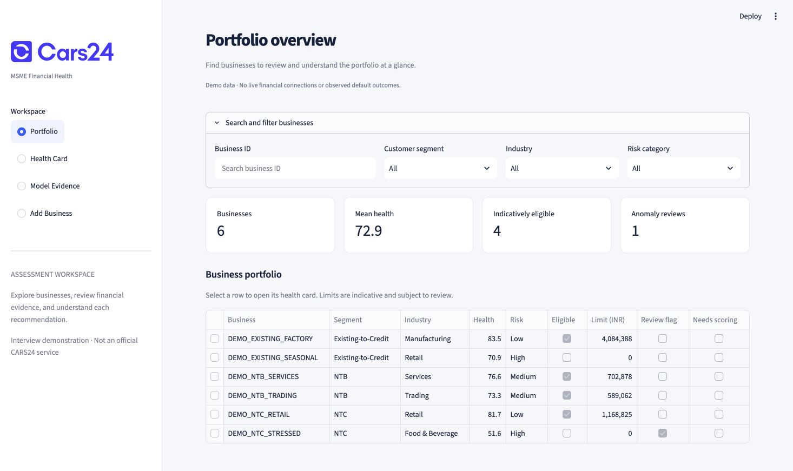

# MSME Financial Health Card

A notebook-first, explainable assessment of synthetic MSME financial data. Seven financial scores, credit eligibility, risk category, indicative credit limit, anomaly review, and a working dashboard/API.

**Live demo:** [cars24-msme-financial-health.streamlit.app](https://cars24-msme-financial-health.streamlit.app/)

The technical submission report is supplied separately as an attachment. This repository contains the implementation, executed notebooks, model artifacts, and evaluation outputs.

**This is an interview demonstration.** Labels are synthetic; there are no observed defaults, dated transaction histories, or anomaly labels. Results do not establish real underwriting accuracy or fairness. No external financial systems are connected.



## Evaluator quick start

| Evaluation criterion | Weight | Direct evidence |
|---|---:|---|
| Problem Understanding | 10% | [Data and modeling choices](#data-and-modeling-choices), [production boundary](ARCHITECTURE.md#boundaries) |
| Data Engineering & Feature Design | 15% | [Executed EDA notebook](data_analysis.ipynb), [shared feature logic](scoring.py), [distribution chart](reports/distributions.png) |
| AI/ML Model Quality | 20% | [Executed modeling notebook](modeling.ipynb), [test metrics](reports/test_metrics.json), [subgroup metrics](reports/subgroup_metrics.csv) |
| Explainability & Interpretability | 10% | [Shared SHAP inference](scoring.py), [behavior tests](tests/test_workflow.py), live app **Why this result?** view |
| Financial Health Card Design | 15% | [Live Health Card](https://cars24-msme-financial-health.streamlit.app/), [printable example](examples/health_card.html) |
| Dashboard & User Experience | 10% | [Live portfolio and card workflow](https://cars24-msme-financial-health.streamlit.app/), [dashboard source](dashboard.py) |
| Scalability & System Architecture | 10% | [Architecture](ARCHITECTURE.md), [workflow image](reports/architecture_workflow.png), [API contract](openapi.json) |
| Innovation & Practicality | 10% | [Eligibility/limit separation and anomaly review](modeling.ipynb), [versioned REST workflow](API.md) |

Start with the live demo, then review the notebooks, held-out metrics, and architecture using the links above. The accompanying repository ZIP contains the same committed files as GitHub; the technical report is attached separately.

## Run locally

Trained artifacts and six demonstration scenarios are included. The supplied dataset is not needed to run the demo.

```bash
conda activate ml
python -m pip install -r requirements.txt
uvicorn api:app --host 127.0.0.1 --port 8000
```

In a second terminal:

```bash
conda activate ml
streamlit run dashboard.py --server.address 127.0.0.1
```

Open [dashboard](http://localhost:8501) and [interactive API docs](http://localhost:8000/docs). The API seeds independent examples on first startup. Local snapshots/assessments persist in `local/demo.sqlite3`. Use `MSME_DB_PATH` to select a separate database and `MSME_API_URL` to point the dashboard at another local API address. Bind to localhost; authentication and tenant isolation are production work.

For a new environment, run `conda env create -f environment.yml`, then activate `ml`. Python 3.14 and exact direct dependency versions match the tested environment. Existing `ml` users should install requirements without recreating their environment.

## Reproduce the notebooks

Place the authorized `msme_synthetic_50k.csv` in project root. Supplied PDF, dataset, ZIP, raw notebook rows, local predictions, and databases are excluded from Git. The README does not redistribute those inputs.

```bash
conda activate ml
python -m ipykernel install --prefix ./local/jupyter --name ml --display-name 'Python (ml)'
export JUPYTER_PATH="$PWD/local/jupyter/share/jupyter"
jupyter nbconvert --to notebook --execute --inplace data_analysis.ipynb --ExecutePreprocessor.timeout=1800
jupyter nbconvert --to notebook --execute --inplace modeling.ipynb --ExecutePreprocessor.timeout=1800
python -m pytest -q
```

Select **Python (ml)** for interactive execution. Run notebooks in order from project root. Training is CPU-only and seeded; thread-level floating-point differences may occur across hardware. The manifest records input checksum, split, model selection, and excluded targets. Models are fitted only on training rows; validation controls selection, and test results evaluate the same frozen artifacts without full-data refitting.

Only load trusted model artifacts: joblib deserialization can execute code.

## Read the solution

| Deliverable | Evidence |
|---|---|
| Data engineering and EDA | [Executed EDA notebook](data_analysis.ipynb), [distribution chart](reports/distributions.png) |
| Models and evaluation | [Executed modeling notebook](modeling.ipynb), [test metrics](reports/test_metrics.json), [score errors](reports/test_scores.csv), [subgroup metrics](reports/subgroup_metrics.csv) |
| Architecture and integrations | [Architecture](ARCHITECTURE.md) |
| Financial health card | Dashboard and [printable example](examples/health_card.html) |
| REST interface | [API design](API.md), [OpenAPI contract](openapi.json) |
| Explainability | Native CatBoost SHAP or linear SHAP, reconstruction checks, source groups, review reasons |
| Practical verification | [Behavior tests](tests/test_workflow.py), [verification report](reports/verification.json) |

## Data and modeling choices

- Dataset: 50,000 businesses, 33 input fields, 11 supplied outcomes, one ID. All outcomes and ID are excluded from predictors.
- EMI payment rate is missing for 65.112%, exactly businesses without existing loans. Preserve “not applicable”; do not impute failed payment.
- Financial amounts have long right tails. Log/scale for linear models, raw values for CatBoost; no automatic outlier deletion. Negative bank surplus is meaningful.
- Correlation report is corrected to 16 unique pairs with absolute Pearson correlation at least 0.90. High correlation among inputs is redundancy, not automatically leakage.
- Full/compact features compete using the agreed validation tolerances. Compact removes turnover and GST sales columns but keeps derived ratios; it does not remove those data sources completely.
- Seven scores use multi-output Ridge/CatBoost; eligibility and risk have separate classifiers; positive limits use log-target regression plus eligibility gating.
- IsolationForest uses selected financial ratios and behavior signals. The training 98th percentile is an explicit demo review threshold. Review rates are audited by segment, industry, loan status and turnover bands.
- CatBoost is trained here. Tree ensembles and linear baselines are a good fit for this structured tabular problem.
- No made-up overall weighting formula: overall and component scores are separate model outputs. SHAP explains predictions, not causal effects or guaranteed improvements.
- Historical charts explicitly say unavailable. Monthly totals, supplied growth, and volatility are shown instead.

## Held-out results

Evaluated on 7,500 held-out synthetic businesses. Overall health MAE **1.76 points**, R² **0.879**. Six component-score MAEs range from **0.23 to 0.33 points**. Eligibility macro-F1 **0.902**, ROC-AUC **0.979**; risk macro-F1 **0.838**.

Positive-limit MAE **₹143,697**; complete eligibility-plus-limit MAE **₹149,944**. Anomaly review rate **2.12%**. The latest warm scoring sample measured **21.3 ms** at p50 and **25.9 ms** at p95, excluding explanations; measured explanation examples took **57–65 ms** on this Mac. Timings are samples, not a production SLA.

Selected: compact CatBoost for scores; compact logistic regression for eligibility/risk; full-feature CatBoost for positive limits. Larger-business limit errors are substantially higher; see subgroup report. No test-driven tuning followed evaluation.

## Small implementation

`scoring.py` is shared by notebooks and API. `api.py` handles persistence and REST. `dashboard.py` is the REST client. No training runs on server startup. The implementation runs locally without extra infrastructure.

## Presentation walkthrough

1. Open Portfolio: inspect risk mix and segment filters.
2. Open Health card: select `DEMO_NTC_RETAIL`, then compare `DEMO_NTC_STRESSED`.
3. Review six dimensions, credit recommendation, bank surplus, and missing-history note.
4. Open “Why this result?”: trace SHAP baseline/contributions and source groups.
5. Download JSON/HTML; inspect Model evidence for held-out and segment metrics.
6. Add a modified snapshot; old assessment stays stored and portfolio marks the business unassessed until rescored.

## Production boundary

Real deployment needs authorized source access, reporting-period alignment, consent lifecycle, security controls, tenant isolation, audit/retention policy, observed-outcome validation, calibration, fairness evaluation, monitoring, and approved lending policy. [Architecture](ARCHITECTURE.md) describes the integration and scaling route. A free hosted interview-demo entrypoint is available; see [deployment instructions](cloud/DEPLOY.md).

## Deployment notes

The deployment uses `cloud/streamlit_app.py` and Python 3.14. The hosted demo uses the same API routes in-process and isolates each visitor in a temporary workspace. See the [deployment notes](cloud/DEPLOY.md). The local REST workflow above remains available.
